# osTicket Help Desk Lab

## Objective
Configure and use the open-source osTicket ticketing system to simulate a
real-world IT help desk environment. Demonstrate the full ticket lifecycle
from end user submission to agent resolution, including triage, SLA assignment,
internal documentation, user communication, escalation, and closure.

## Tools & Technologies Used
- Microsoft Azure (VM hosting)
- Windows 11 Pro
- osTicket (open source ticketing system)
- Active Directory (integrated for password reset and account unlock tickets)

## Real-World Relevance
Every IT help desk environment uses a ticketing system to track, prioritize,
and resolve user issues. While specific platforms vary (ServiceNow, Zendesk,
Freshdesk, Jira), the core workflow is universal. This lab demonstrates
familiarity with the full help desk ticket lifecycle and mirrors the daily
responsibilities of a Tier 1 Help Desk Technician.

---

## Part 1 — Help Desk Configuration

Configured osTicket to simulate a realistic IT department structure including
departments, support teams, agents with appropriate access levels, SLA plans,
and help topics for ticket categorization and routing.

### Departments
Created departments to route tickets to the correct team based on issue type.

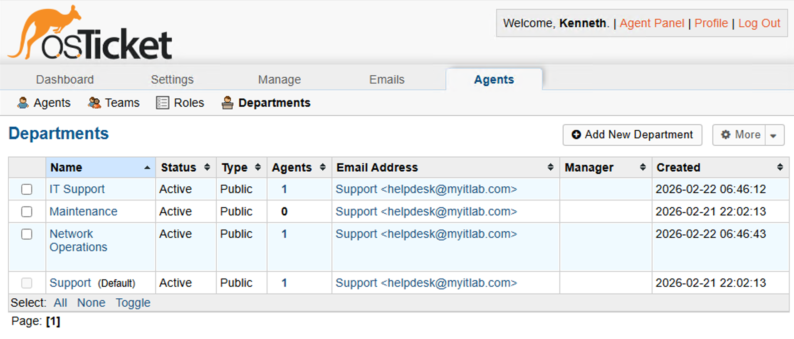

### Teams
Configured Tier 1 and Tier 2 support teams to enable the escalation workflow.

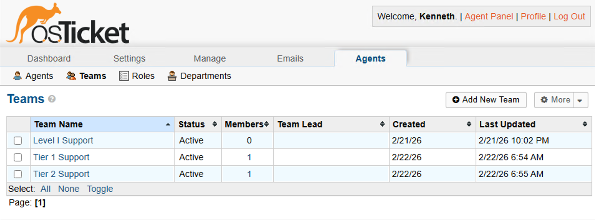

### Agents
Created help desk agents and assigned them to departments and teams with
appropriate access levels.

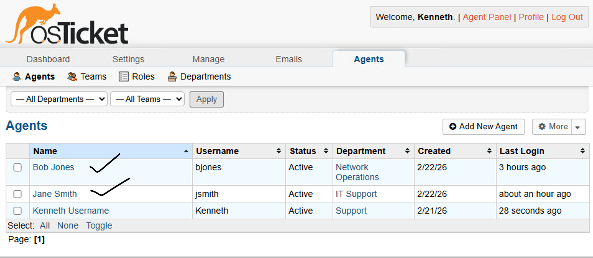
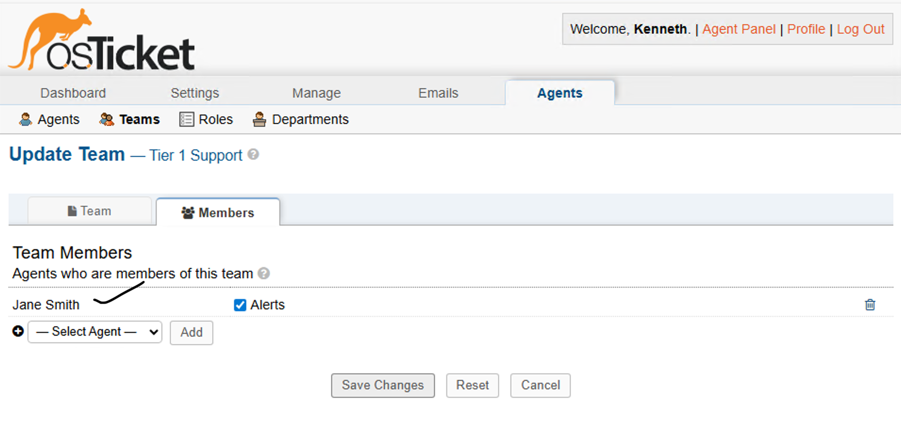

### SLA Plans
Configured three severity levels reflecting real-world IT priority standards:

| Plan  | Response Time | Schedule            | Use Case                         |
|-------|---------------|---------------------|----------------------------------|
| SEV-A | 1 hour        | 24/7                | Critical outages, all users down |
| SEV-B | 4 hours       | 24/7                | Moderate business impact         |
| SEV-C | 8 hours       | Business hours only | Low priority, minimal impact     |

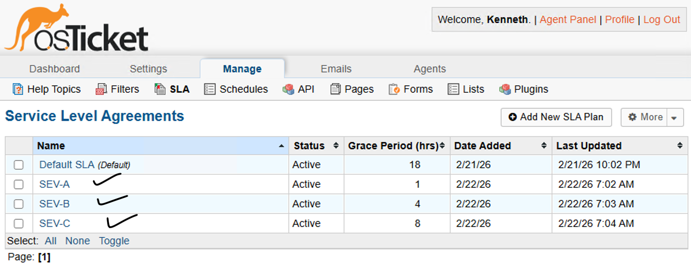

### Help Topics
Created common help topics mapping to real Tier 1 ticket categories for
accurate routing and reporting.

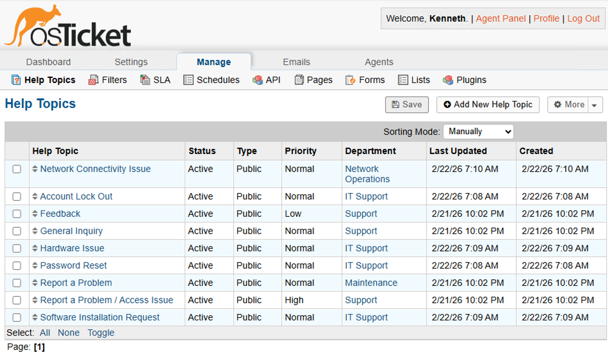

---

## Part 2 — Ticket Lifecycle Demonstration

### Ticket 1 — Password Reset

A user submitted a ticket reporting inability to log into their computer.
The ticket was triaged, assigned an appropriate SLA, documented with internal
notes, and resolved by resetting the user's password in Active Directory.
The resolution was communicated back to the user through the ticket thread.

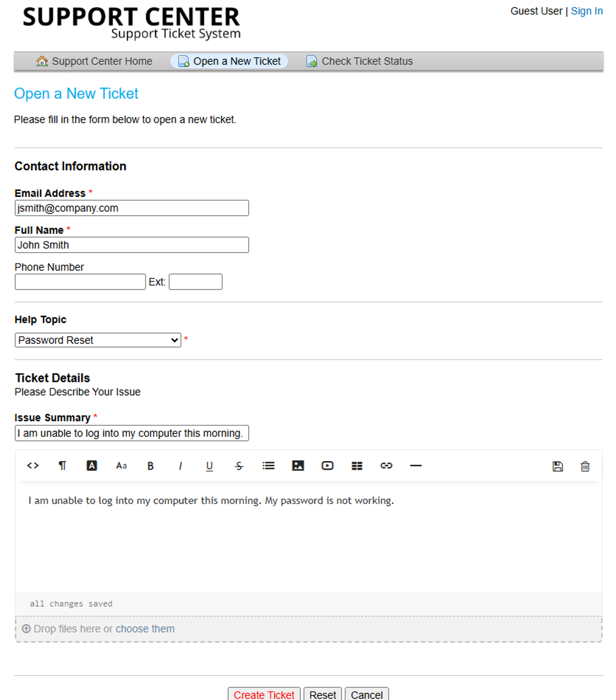
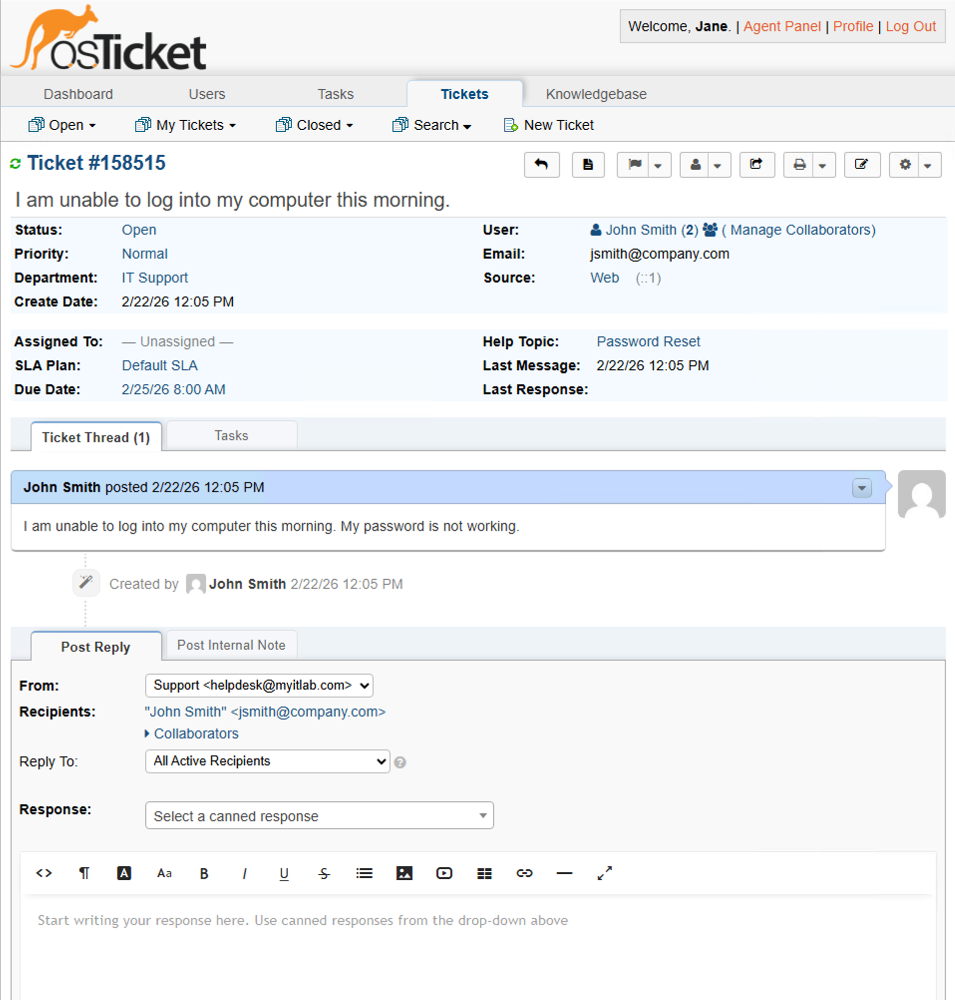
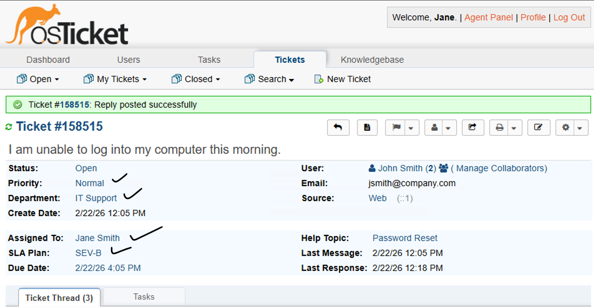
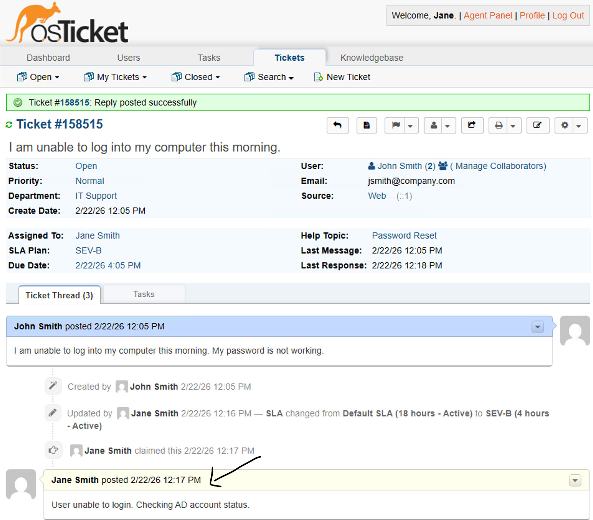
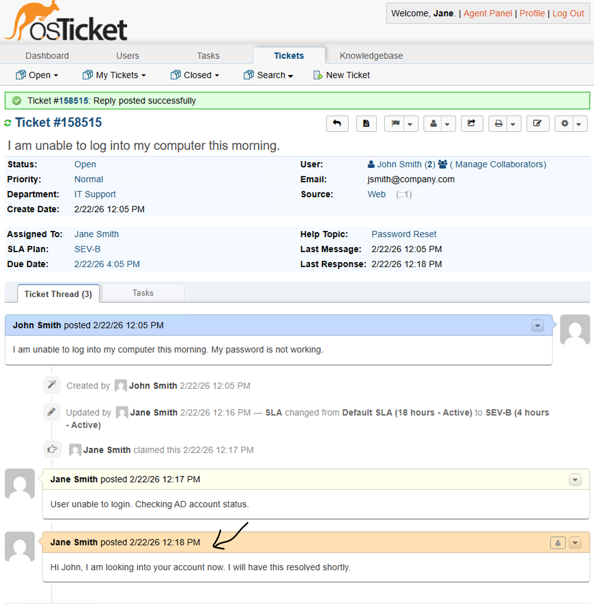
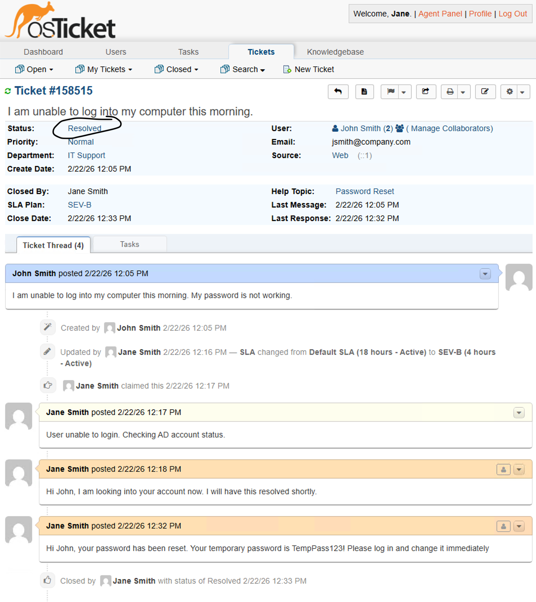

---

### Ticket 2 — Account Lockout

A user's account was locked after multiple failed login attempts. The account
was located in Active Directory, unlocked, and the user was notified of the
resolution through the ticket system.

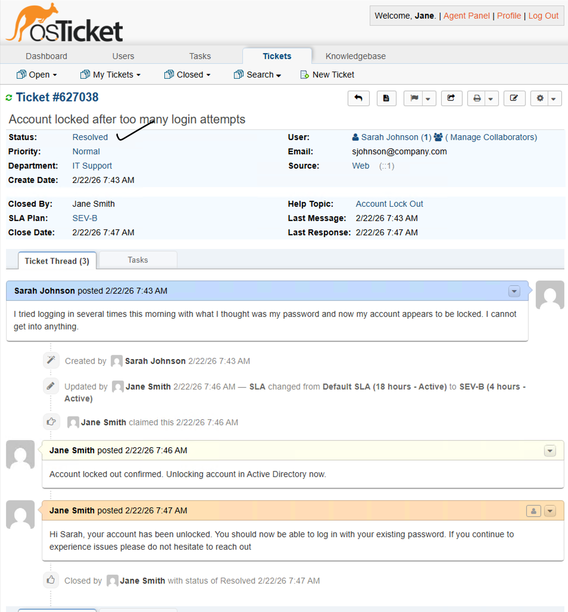

---

### Ticket 3 — Software Request Escalated to Tier 2

A software installation request was received requiring elevated permissions
and manager approval. The ticket was documented, escalated from Tier 1 to
Tier 2 support, and reassigned to a senior agent — demonstrating proper
escalation workflow and professional user communication.

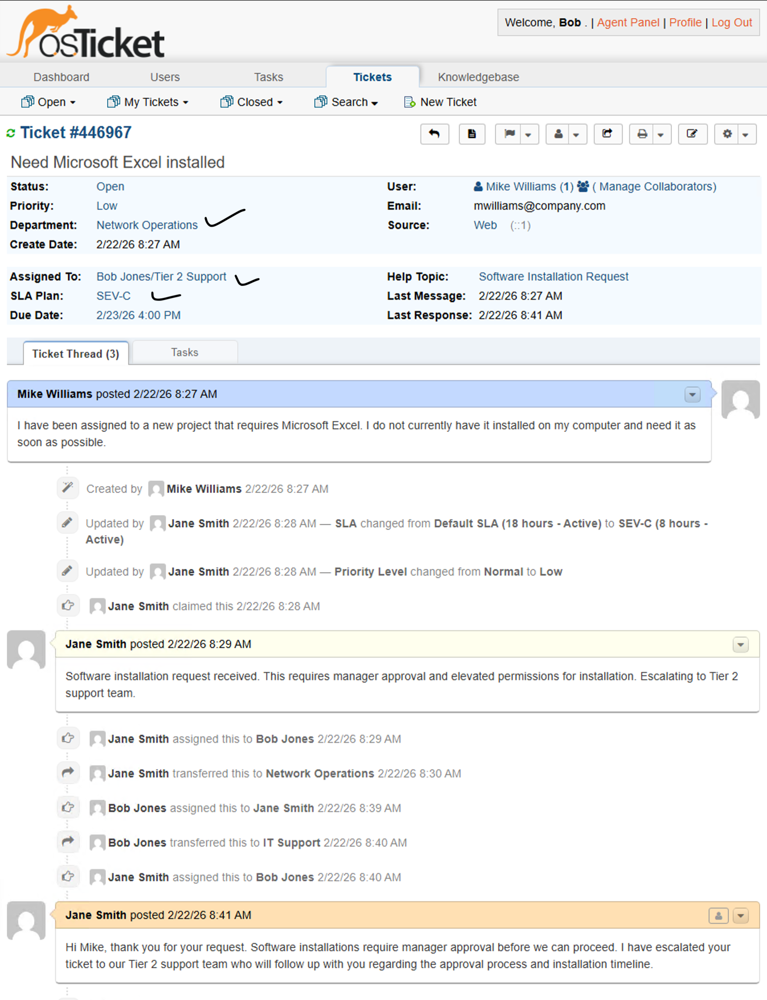

---

## Part 3 — Closed Tickets Queue

All resolved tickets are visible in the closed queue confirming complete
ticket lifecycle management from submission through closure.

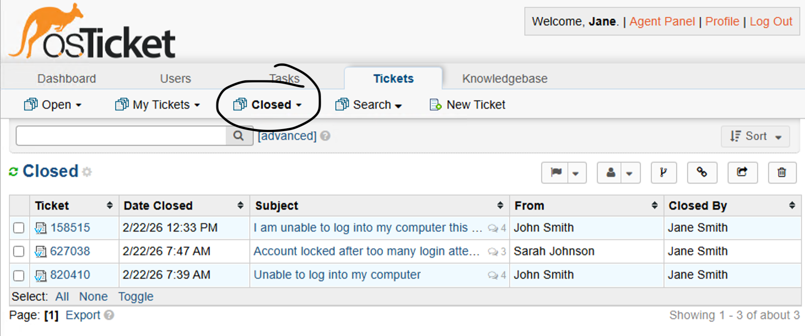

---

## Key Concepts Demonstrated

| Concept             | Description                                                    |
|---------------------|----------------------------------------------------------------|
| Ticket Intake       | End user submission via self-service web portal                |
| Triage              | Priority, SLA, and department assignment                       |
| Internal Notes      | Troubleshooting documentation not visible to the end user      |
| User Communication  | Professional, clear responses to end users throughout process  |
| SLA Management      | Appropriate severity classification and response expectations  |
| AD Integration      | Password reset and account unlock tied to Active Directory     |
| Escalation Workflow | Proper Tier 1 to Tier 2 handoff with full documentation       |
| Ticket Closure      | Resolution documented and communicated before closing          |

---

## Notes
This lab was performed using a Windows 11 Pro VM hosted in Microsoft Azure.
Active Directory integration references the domain controller configured in
a separate AD lab, demonstrating how ticketing systems connect to real
enterprise infrastructure in a Tier 1 help desk environment.
